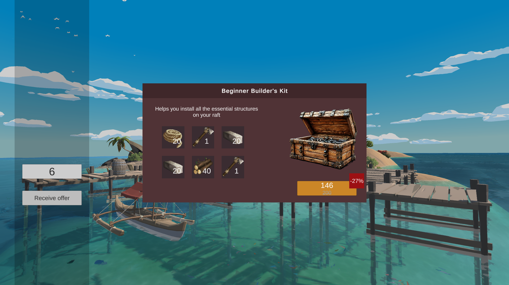

# JustMoby test task
 

  

# Purchase Offer Window

This project implements an item display window in Unity, following the MVC (Model-View-Controller) pattern.

## Features

- **MVC Architecture**: The project is organized using the MVC pattern.
- **Price Display with Discount Option**: Supports displaying prices with or without a discount.
- **Icon Management**: Icons are linked to their respective names, managed via `ScriptableObject` for sprite association.

## Window Input Parameters

The following parameters can be provided externally to customize the window:

1. **Header Text**: Title text of the window.
2. **Description Text**: Description text for the window.
3. **Items**: List of items to display, defined as name and quantity (between 3 and 6 items).
4. **Price**: The item price to display.
5. **Discount**: An optional discount for the item price.
6. **Main Icon Name**: The name of the main icon for the window.

## Window Output

- **Button Click Event**: Triggers an event when the price button is clicked.

## Setup for Testing

To test the functionality, a simple screen is included with:

1. A button to open the item display window.
2. An input field to specify the count of items to display in the window.
